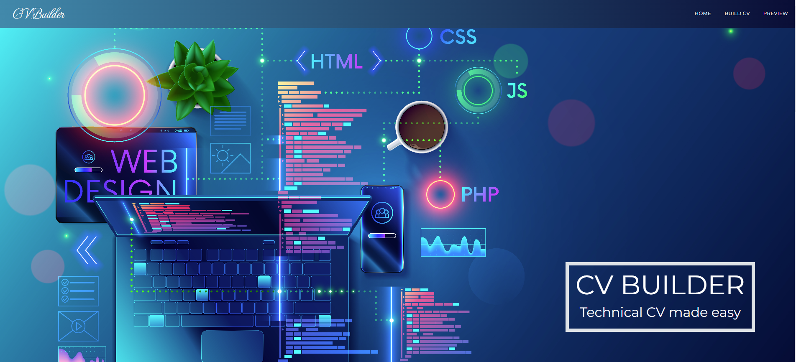

# CV Builder
[](https://opensource.org/licenses/MIT)

## Description
This is a code for [CV Builder](https://main--serene-kelpie-1e2c47.netlify.app/) - a web application that lets the user dynamically generate a beautifully styled ATS friendly and industry standard CV by inputting their data into a form. 

## Use
The app is aimed at recent university and bootcamp graduates looking for a job in the software development industry. It features a form that prompts the user to input their Skills, Projects, Experience and Education, as well as a ChatGPT powered Summary field that optionally lets the user answer a couple of simple prompts to generate a powerful suggestion for a professional summary that displays at the top of their CV.

## Reason for development
With the release of ChatGPT, employers report a higher number of high-quality CVs that are closely aligned with the job description. Source: [www.computerworld.com](https://www.computerworld.com/article/3688336/job-seekers-are-using-chatgpt-to-write-resumes-and-nabbing-jobs.html)

This means that in order to stand out at the stage where a CV gets reviewed by a human, every little bit can help. A skillfully implemented design can add to the overall quality of a candidate's CV, distinguishing them from the field of other equally qualified candidates. 

Implementing a beautiful design in a CV can be challenging both on a personal level (some people are better at aesthetic design than others), and on a practical level with word processing software such as Microsoft Word requiring a level of competence in terms of layout implementation. Most MS Word users can probably attest to having run into issues at one point or another when attempting to create a styled Word document.

Finally, most manual styling in Word requires Table and Column implementation, which is not an Applicant Tracking Software (ATS) friendly practice, since ATS reads CV data from left to right.

Our app was built as an attempt to address all of the issues above, and demonstrates how they can be solved in its current MVP stage.

## User Story

```
As a person looking for a job in software development industry,

I want an app that lets me input my professional experience,skills and education,
lets me enhance my data with AI,
and then creates a nicely styled PDF for me,

So that I could have a professionally designed CV
that’s optimized for Applicant Tracking Software and is aesthetically pleasing,
increasing my chances for an interview.

```


## Features
* Build screen with form input fields
* Preview screen with the formatted CV previewed
* A print view available via the 'print' button
* Real-time data update implemented with Redux 
* A modal to prompt user to add data to Chat GPT prompt for summary generation


## Technologies used
* ReactJS
* node
* React Redux
* [Chat GPT API](https://platform.openai.com/docs)
* Netlify & Netlify environment variable 
* Material UI
* React-to-print
* Bootstrap
* CSS

Deployment: Netlify


## Demo
### Desktop Home page UI:


### Mobile Home page UI:


## Credits

The app was built by a project team during [Trilogy Education](https://2u.com/) Front End Web Development bootcamp, sponsored by the [Skills For Life](https://skillsforlife.edx.org/) program.

The development team are:

* [Jayashree Karthikeyan](https://github.com/JayaPK21)
* [Maija Kozlova](https://github.com/maijako)
* [Hamza Osman](https://github.com/Realstranger01)

The home screen features these royalty free background images:
* 1490541647
* 2140212583
* 2170929773


## Licence
MIT
